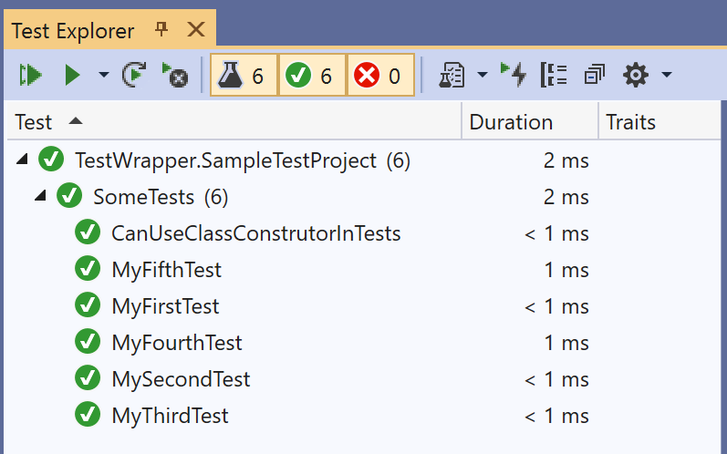

# SimpleTesting

[](LICENSE)

Helper functionality to make it easier to get started writing coded tests in .NET

- Only need a single package.
- No libraries, tools, patterns, or conventions to learn.
- Avoid accidental false positives.

## Install a single package

`> Install-Package SimpleTesting -Version 1.0.0`

This includes all the dependencies needed to create and run tests within Visual Studio.

## Write the C# code you know

There's no need to learn any extra libraries, tools, or patterns.

There's no markup to add. All you need to do is have the class containing the tests inherit from `SimpleTesting.IContainSimpleTests`.

```cs
public class SomeSimpleTests
    : SimpleTesting.IContainSimpleTests
{
    public bool MyFirstTest()
    {
        return true;
    }
}
```

Any method that is public, takes no parameters, and return `bool` (or `Task<bool>`) will be treated as a test. Even static methods work.

The class must have a parameterless constructor. If one is added, it is called before each test as a new class instance is created for each test execution.

Other than that, you can do what you like.

All these are valid:

```cs
public class SomeTests : SimpleTesting.IContainSimpleTests
{
    readonly int internalInt;

    public SomeTests()
    {
        internalInt = 42;
    }

    public bool MyFirstTest()
    {
        return true;
    }

    public static bool MySecondTest()
    {
        return true;
    }

    public bool MyThirdTest() => true;

    public async Task<bool> MyFourthTest()
    {
        await Task.CompletedTask;
        return true;
    }
    public static async Task<bool> MyFifthTest()
    {
        await Task.CompletedTask;
        return true;
    }

    public bool CanUseClassConstrutorInTests()
    {
        return internalInt == 42;
    }
}
```

When you build the project, the tests will show up in the Test Explorer window.



## No accidental false positives

The following is a succesful test. But it shouldn't be!

```cs
[TestClass]
public class SomeMoreTests
{
    [TestMethod]
    public void MyFirstTest()
    {
    }
}
```

SimpleTesting forces you to explicitly state whether a test passes or fails by returning true or false.

If you really need to be able to report inconclusive tests then add those tests directly.

## Going further

Want to do more with your tests? They're easy to convert to use any other testing tool or framework and can even be combined with traditionally written unit tests.

## Future enhancements

Got any thoughts, feedback, or suggestions for improvement? Please [raise an issue](https://github.com/mrlacey/SimpleTesting/issues/new).
